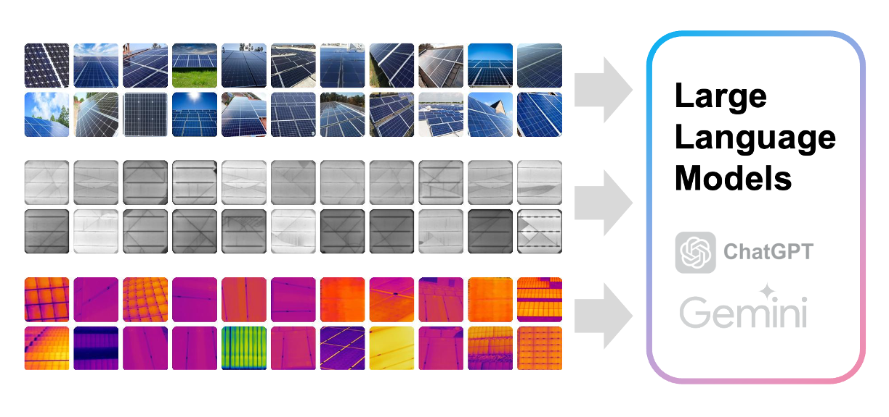
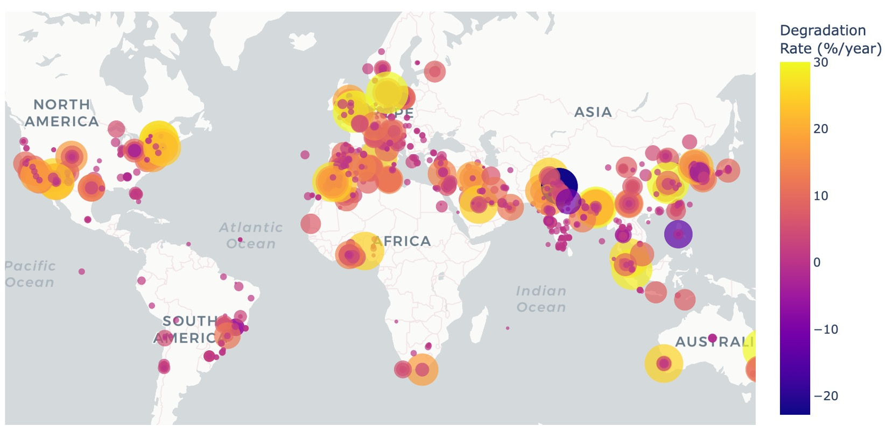
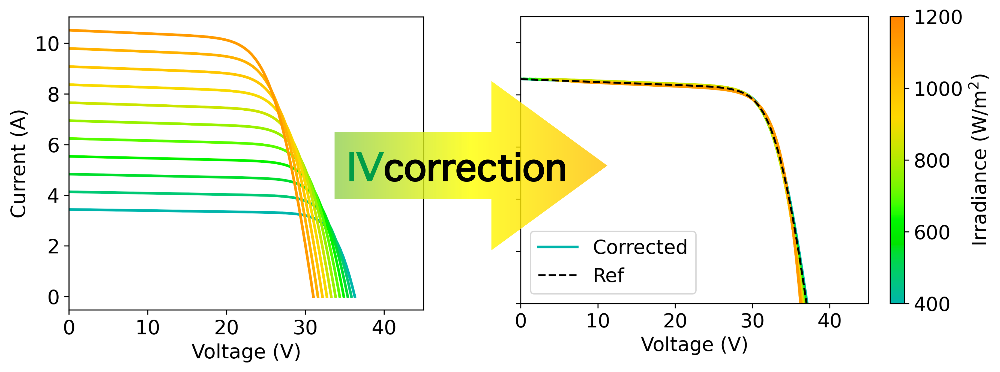
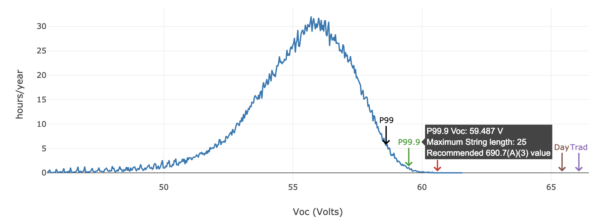
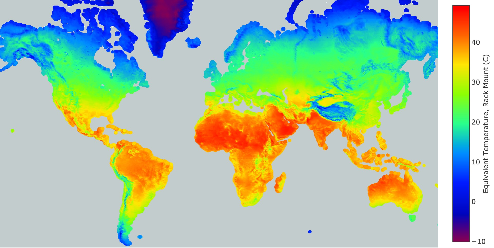

# PVTOOLS


PVTools is a collection of **open-source web applications and Python tools for photovoltaic (PV) reliability and system analysis**.

The tools are developed by the **[LBL HackingMaterials Group](https://hackingmaterials.lbl.gov/)** at **Lawrence Berkeley National Laboratory** as part of the **[DuraMAT Consortium](https://www.duramat.org/)**.

PVTools provides interactive tools and datasets to support **PV system design, degradation analysis, and reliability research**.

---

# Table of Contents

- [Cite our work](#cite-our-work)
- [Applications](#applications)
- [Repository Structure](#repository-structure)
- [Logging and Privacy](#logging-and-privacy)
- [Contributors](#contributors)
- [Copyright](#copyright)

---

# Cite our work
If you use **PVTOOLS** in your research, please cite:

B. Li, T. Karin, X. Chen, and A. Jain, pvtools: Toolkit for Photovoltaic Data Analysis and Modeling, Zenodo, Jun. 2022. DOI: https://doi.org/10.5281/zenodo.15654456

# Applications

## PV Image Analysis Using LLMs

<p align="center">

</p>

Fault detection using **visible, EL, and IR photovoltaic images** with large language models.

Features:

- AI-assisted PV defect detection
- Multi-image modality support
- LLM-assisted interpretation

---

## Global PV Field Performance

<p align="center">

</p>

Interactive tool for exploring **global PV degradation datasets**.

Capabilities:

- Field degradation statistics
- Global reliability benchmarking
- Interactive visualization

---

## IV Curve Correction Tool

<p align="center">

</p>

Correct photovoltaic **IV curves** to standard test conditions following:

**IEC 60891:2021**

Features:

- Field IV curve correction
- Comparison between measured and corrected curves
- Export of corrected datasets

---

## String Length Calculator

<p align="center">

</p>

Calculate the **maximum allowable PV string length** for a given system location.

Inputs include:

- Module parameters
- Temperature conditions
- Geographic location

The tool follows NEC-compatible PV system design calculations.

---

## Photovoltaic Climate Zones

<p align="center">

</p>

Interactive visualization of **environmental stressors affecting PV systems worldwide**.

Includes:

- Climate zone classification
- Environmental stress distribution
- Reliability stress mapping

---

# Repository Structure

Clone the repository:

```bash
pvtools/
├── index.py          # Homepage for the PVTools Dash application
├── pages/            # Individual application pages
├── assets/           # Images, stylesheets, and UI resources
├── utils/            # Shared utilities and helper functions
└── requirements.txt  # Python dependencies
```

# Logging and Privacy

We take privacy seriously.

We use coralogix to log basic usage information. This allows us to determine how many unique users have accessed the site.

We also log each time the 'calculate' button is pressed, but do not record any metadata about the system design.  


# Contributors
Baojie Li, Todd Karin, Xin Chen, Anubhav Jain


# Copyright

© 2026 PVTOOLS | Lawrence Berkeley National Laboratory

NOTICE.  This Software was developed under funding from the U.S. Department
of Energy and the U.S. Government consequently retains certain rights.  As
such, the U.S. Government has been granted for itself and others acting on
its behalf a paid-up, nonexclusive, irrevocable, worldwide license in the
Software to reproduce, distribute copies to the public, prepare derivative 
works, and perform publicly and display publicly, and to permit others to do so.
